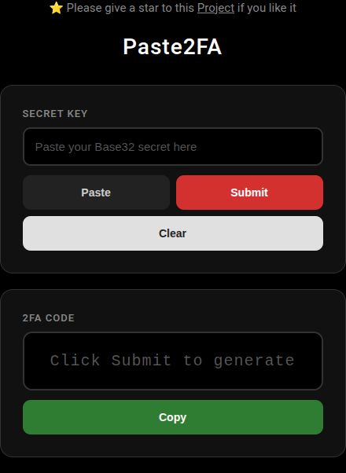

<p align="center">
  
</p>

<h1 align="center">⭐️ Paste2FA</h1>
<p align="center">
  <strong>Paste a 2FA secret, get a time-based code instantly.</strong>
  <br>
  <em>Zero tracking. Zero logs. Zero ads. Your secret never leaves your browser.</em>
</p>

<p align="center">
  <a href="https://yesmohsen.github.io/Paste2FA" target="_blank">🚀 Live Demo</a>
  ·
  <a href="https://github.com/Yesmohsen/Paste2FA/issues" target="_blank">📝 Report Bug</a>
  ·
  <a href="https://github.com/Yesmohsen/Paste2FA" target="_blank">⭐️ Star the Project</a>
</p>

<p align="center">
  
</p>

---

## ✨ Features

- **🔒 100% Client-Side** — Your secret key is never sent anywhere. All TOTP generation happens in your browser using the Web Crypto API.
- **📋 Paste from Clipboard** — One click to paste your Base32 secret.
- **⏱ RFC 6238 Compliant** — Standard TOTP with 30-second time step and 6-digit codes.
- **📱 Responsive** — Works on desktop and mobile.
- **🌙 Dark Theme** — Easy on the eyes.
- **🚫 No Dependencies** — Pure HTML, CSS, and JavaScript. Zero libraries, zero trackers, zero bloat.
- **⚡ Fast** — Generates codes in milliseconds.

## 🚀 Usage

1. Open the [live page](https://yesmohsen.github.io/Paste2FA).
2. Paste your Base32 2FA secret key into the input box (or type it manually).
3. Click **Submit** — your 6-digit TOTP code appears instantly.
4. Click **Copy** to copy the code and use it for authentication.

## 🧠 How It Works

The TOTP (Time-Based One-Time Password) algorithm works in four simple steps:

```
Secret (Base32) → Decode → HMAC-SHA1 → Truncate → 6-Digit Code
```

1. **Base32 Decode** — Your secret key (e.g., `JBSWY3DPEHPK3PXP`) is decoded from Base32 into raw bytes.
2. **Time Counter** — The current Unix timestamp is divided by 30 (the time step) to create a moving counter.
3. **HMAC-SHA1** — The counter is hashed with your secret using HMAC-SHA1 via the browser's native **Web Crypto API**.
4. **Dynamic Truncation** — The hash is truncated to produce a 6-digit code that changes every 30 seconds.

## 🛠 Tech Stack

| Technology | Purpose |
|---|---|
| **HTML5** | Structure |
| **CSS3** | Styling (pure, no frameworks) |
| **JavaScript (ES2020+)** | TOTP algorithm & interactivity |
| **Web Crypto API** | Cryptographically secure HMAC-SHA1 (native, no libraries) |
| **Clipboard API** | Paste & Copy functionality |

## 📦 Deployment

This is a static site. Deploy anywhere in seconds:

### GitHub Pages

```bash
git push origin main
```

Then go to **Settings → Pages** and select `main` branch with `/` root.

### Any Static Host

Just copy `index.html` to any web server or static host (Netlify, Vercel, Cloudflare Pages, etc.).

## 🧪 Test Secret

You can test with this well-known Base32 secret:

```
JBSWY3DPEHPK3PXP
```

> ⚠️ This is a demo secret from TOTP RFC examples. Use your real secret for actual 2FA codes.

## 📄 License

This project is open source under the [MIT License](LICENSE).

---

<p align="center">
  Made with ❤️ by <a href="https://github.com/Yesmohsen">Yesmohsen</a>
  <br>
  ⭐️ Star this <a href="https://github.com/Yesmohsen/Paste2FA">Project</a> on GitHub if you find it useful!
</p>
